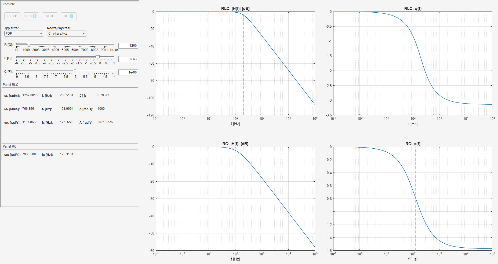
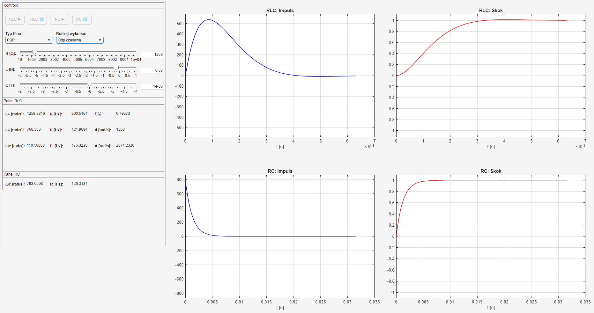
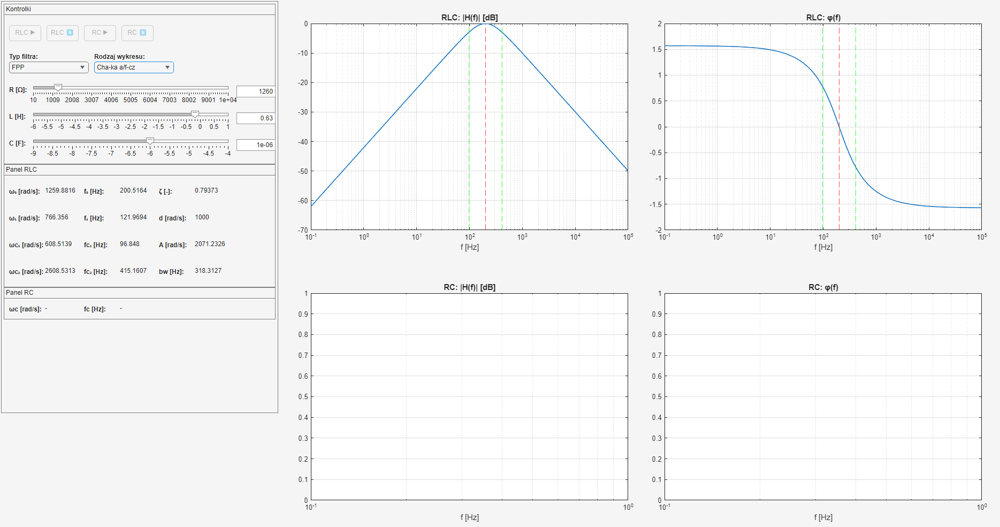
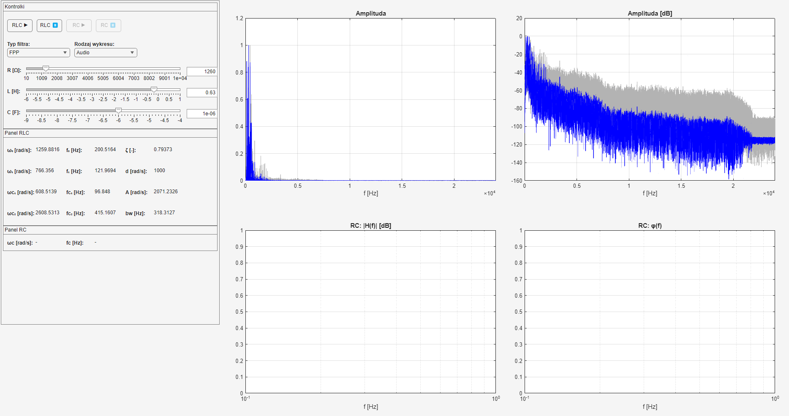

# RLC and RC Filters Simulation - AGH Numerical Methods Project

Individual academic project focused on the simulation and analysis of low-pass, high-pass and band-pass filters using MATLAB.

## Project overview

The project involved modelling electrical filters using RLC and RC parameters and analysing their frequency characteristics, time-domain response and filtering effects on a piano melody recorded by me.

The application allows the user to:

- select the type of filter
- configure circuit parameters
- choose the type of analysis or visualization
- observe changes in cutoff frequency and attenuation
- analyse amplitude and phase characteristics
- analyse the time-domain response
- apply the selected filter to an audio recording
- listen to and visualize the filtered audio signal

## Project Preview

### Low-Pass Filter — Amplitude and Phase Response

### Low-Pass Filter — Time Response

### Band-Pass Filter — Amplitude and Phase Response

### Band-Pass Filter — Filtered Audio

